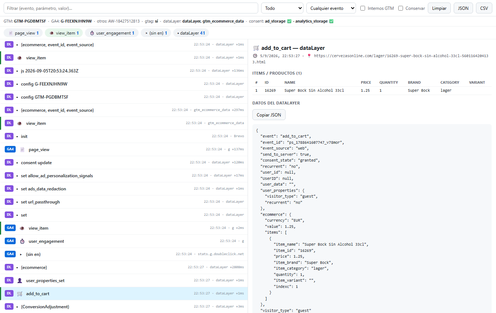
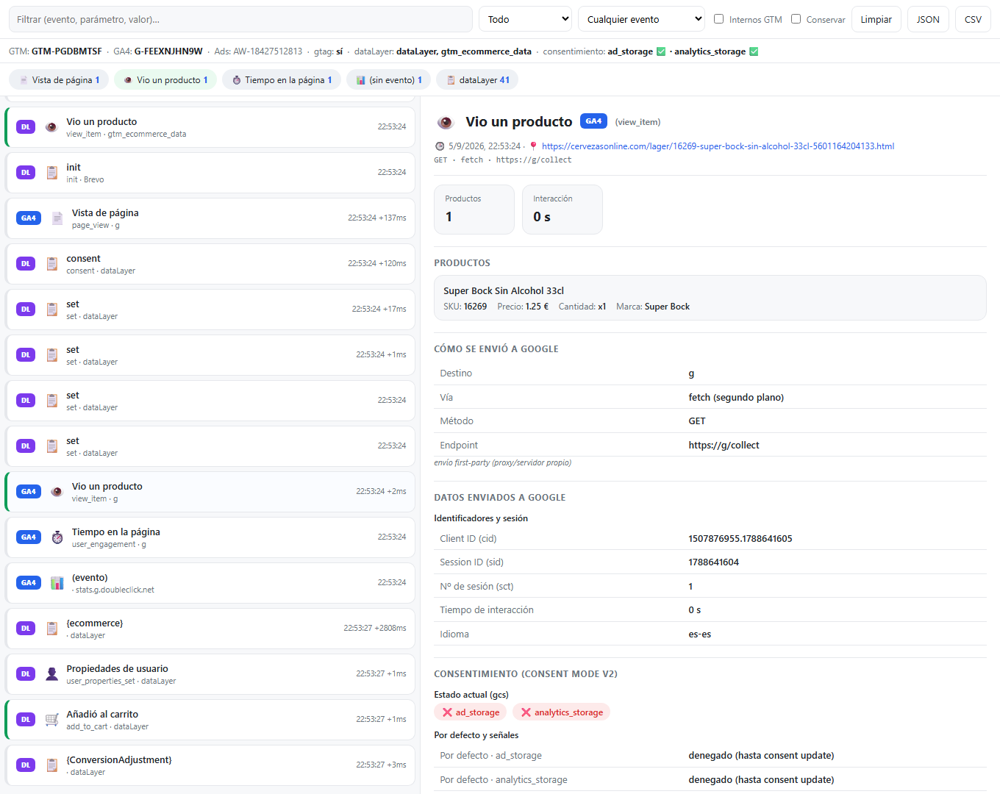
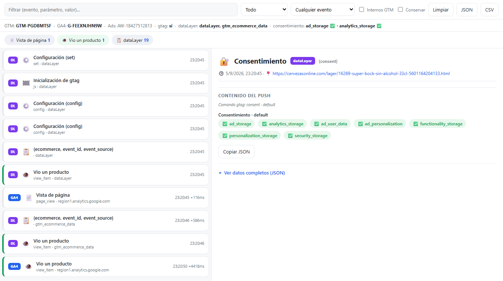
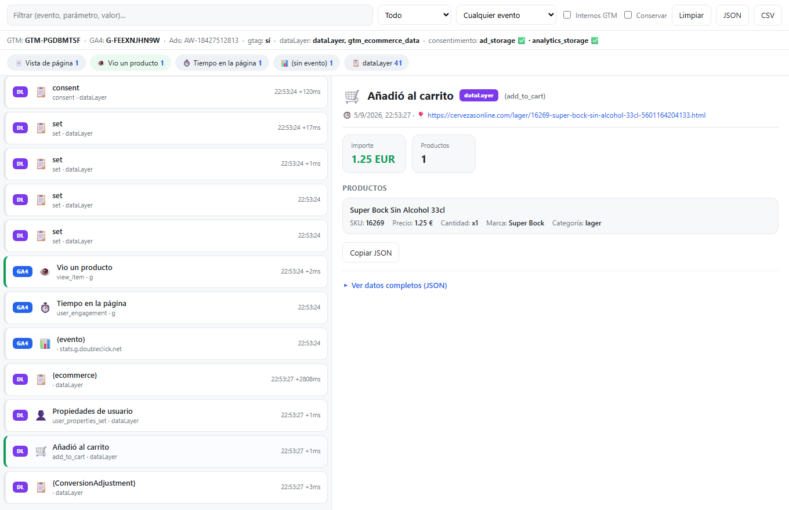

# GTM & GA4 Debugger

**A DevTools panel that catches every GA4 hit (regional, first-party, server-side GTM, sendBeacon) and the full dataLayer flow that commercial extensions miss.**

- All GA4 hits regardless of hostname or transport
- Full dataLayer timeline
- Own DevTools tab, no data leaves the browser

> 🇪🇸 Documentación completa en castellano más abajo · Full docs below (Spanish).

⭐ If this saves you time, a star helps other people find it.

---

<p align="center">
  
</p>

# 🔎 Ecom GTM & GA4 Debugger

Inspector de **Google Tag Manager (dataLayer)** y **hits de GA4** que captura lo que las
extensiones comerciales fallan: **todos** los hits GA4 sin importar el hostname
(`region1.analytics.google.com`, sGTM propio, gateway first-party) ni el transporte
(`fetch`, `sendBeacon`, `XHR`, pixel), más el flujo completo del **dataLayer**.

Sólo GTM + GA4. Se maneja desde una pestaña propia de **DevTools**. Creado por **[gmartos.es](https://gmartos.es)**.

## Capturas

| Vista general | Detalle de un hit GA4 |
|---|---|
|  |  |

| dataLayer (consent) | add_to_cart |
|---|---|
|  |  |

## Instalación
1. `chrome://extensions` → activa **Modo de desarrollador**.
2. **Cargar descomprimida** → selecciona `ecom-gtm-ga4-debugger/`.
3. Abre la web, **abre DevTools** → pestaña **GA4 / GTM** → **recarga la página** (F5).

El hook vive en `document_start`, así que sin recargar con DevTools abierto no verás el
`page_view` inicial.

## Qué captura y muestra
- **Detección por firma del payload, no por dominio**: es GA4 si la ruta acaba en `/collect`
  (`/g/collect`, `/j/collect`, `/mp/collect`), `v=2` y `tid` empieza por `G-`. Coge cualquier
  endpoint, incluido **server-side**.
- **Cuatro transportes**: `fetch`, `navigator.sendBeacon`, `XMLHttpRequest`, `Image.src`.
- **dataLayer.push** interceptado con getter/setter, sigue funcionando cuando `gtm.js`
  sustituye el `push` (lo que rompe los hooks ingenuos). Incluye **replay** del estado previo.
- **Entorno**: contenedores GTM, streams GA4, si `gtag` está cargado, dataLayers detectados.

## Diseño y control del ruido
- **Oculta por defecto los eventos internos de GTM** (`gtm.js`, `gtm.dom`, `gtm.load`,
  `gtm.linkClick`, `gtm.scrollDepth`…) para que el dataLayer no crezca hasta el infinito.
  Interruptor **«Internos GTM»** para verlos cuando hagan falta.
- **Vista** rápida: Todo · **🛒 Ecommerce** · Sólo GA4 · Sólo dataLayer · ⚠ Con avisos.
- **Límite de historial** (1500 filas) y **render con throttle** para que la lista no se
  bloquee ni falle el clic aunque lleguen cientos de eventos.
- **Auto-detección de dataLayers con nombre personalizado** (p. ej. `gtm_ecommerce_data`),
  no sólo `dataLayer`, para no perder eventos de ecommerce.

> **Probado en real** contra una tienda PrestaShop con GTM + GA4 (GTM-…, GA4 G-…): captura
> `page_view`, `view_item` y `add_to_cart` aunque los hits salgan por **first-party** al host
> `g/collect`, e ignora los de Google Ads (`AW-`) y remarketing.

## Opciones de seguimiento / análisis (panel)
- **Diccionario ampliado** de parámetros GA4 en castellano (cliente, sesión, engagement,
  consentimiento, geo, campaña, DMA, US-Privacy, GDPR, experimentos…).
- **Iconos por tipo de evento** y clasificación (`page_view`, `purchase`, `add_to_cart`,
  `view_item`, `begin_checkout`, `refund`, `search`, `login`, `video_*`, `form_*`…).
- **Items de ecommerce** (`pr1…prN`) descodificados en tabla legible (SKU, nombre, marca,
  categoría, variante, precio, cantidad, cupón, descuento, posición y lista/promoción).
- **Validación de ecommerce**: marca en ⚠ los parámetros **obligatorios que faltan** según el
  evento (`transaction_id`, `value`, `currency`, `items`) y avisa de **`value` sin `currency`**.
- **Detección de `purchase` duplicados** (mismo `transaction_id` enviado dos veces).
- **Consent Mode v2**: descodifica `gcs` y `gcd` (estado por defecto y actualizado de
  `ad_storage`, `analytics_storage`, `ad_user_data`, `ad_personalization`), con distintivo en
  la barra de entorno.
- **Sesión / usuario resaltados**: `cid`, `sid`, `sct`, `_et`, `_fv`, `_ss`, `uid`.
- **Tiempo entre hits** (delta en ms) para ver el orden real de disparo.
- **Resumen** por tipo de evento (contadores) y de avisos; cada chip filtra al pulsarlo.
- **Filtros**: búsqueda de texto, por tipo de evento, sólo GA4, sólo dataLayer, sólo con avisos.
- **Ver payload en crudo** (querystring o cuerpo POST) por hit y **copiar** el evento en JSON.
- **Exportar** a **JSON** y a **CSV** (fecha, tipo, transporte, host, evento, transaction_id,
  value, currency, nº items, avisos).
- **Histórico de eventos con hora**: cada fila lleva su hora; con **«Conservar al recargar»** el
  histórico se mantiene entre navegaciones y **persiste** aunque el service worker se duerma
  (`chrome.storage.session`).
- **URL de la página**: cada evento muestra en qué página (URL) ocurrió, en la fila y en el detalle.
- **Datos del dataLayer**: cada `push` se ve completo en JSON, con botón de **copiar**.
- **Conservar al recargar**, limpiar y **badge** con el nº de eventos en el icono.

## Diagnóstico rápido en PrestaShop con GTM + GA4
Si ves la línea `DL` (dataLayer) pero **no** la `GA4` correspondiente → el trigger del tag en
GTM no dispara. Si ves ambas → capa de datos y envío OK; el problema está en la config de GA4
(streams, filtros internos). El aviso ⚠ en un `purchase` sin `value`/`items` explica ventas que
no cuadran en los informes de ecommerce.

## Estructura
```
ecom-gtm-ga4-debugger/
├── manifest.json
└── src/
    ├── inject.js        # MAIN world: hooks de dataLayer y red (+ payload en crudo)
    ├── bridge.js        # ISOLATED world: puente postMessage → runtime
    ├── background.js    # service worker: buffer por tabId + badge
    ├── devtools.html / devtools.js   # crea la pestaña de DevTools
    ├── panel.html / panel.css / panel.js   # el inspector
```

## Limitaciones
- **Service worker MV3** se duerme a ~30 s de inactividad; con el panel abierto, el puerto lo
  mantiene vivo. Para persistencia real, cambiar el `Map` por `chrome.storage.session`.
- **Hits antes del hook**: imposibles si algo corre antes de `document_start` (raro).
- **sGTM que ofusca parámetros**: si tu server-side no manda `tid`/`v` en la URL, ajustar
  `classify()` en `inject.js` para filtrar por el hostname del contenedor.
- **`sendBeacon` con Blob**: el cuerpo se lee async, ese hit puede llegar con unos ms de retraso.

## Autor y servicios

Creado por **[gmartos.es](https://gmartos.es)** — desarrollo para e-commerce:

- Módulos **PrestaShop** y **WooCommerce** a medida.
- **Extensiones de navegador** e integraciones.
- **Analítica GA4/GTM**, medición y **Consent Mode**.
- **SEO** y automatizaciones para tiendas online.

👉 **[gmartos.es](https://gmartos.es)**

## Licencia

MIT — libre para usar y modificar.
